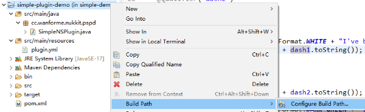
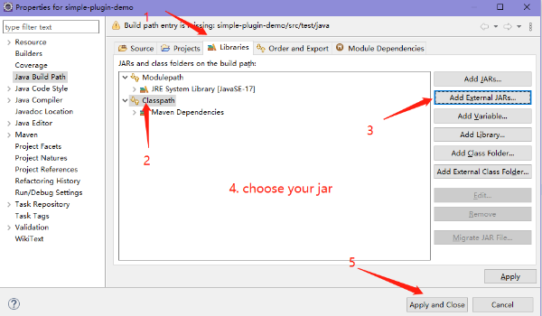
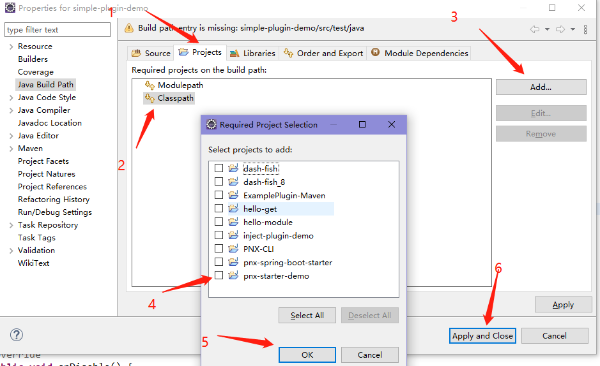

## pnx-starter-plugin-demo
基于 [px-starter-demo](https://github.com/WanneSimon/pnx-starter-demo) 的简单插件实例。
不同之处在于使用 `spring` 注解进行开发。 

环境  
pnx-starter-demo-2.0-SNAPSHOT  
PowerNukkitX 1.20.40-r1

**a. 释义**  
`pnx`: `PowerNukkitX`  
核心： 基于 `pnx-spring-boot-starter` 的定制化 `pnx`
  
**b. 项目说明**  
`simple-demo` : 最基础的样例。注入核心内的 `bean`   
`inject-plugin-demo` : 在 `inject-plugin-demo` 中注入 `simple-demo` 内的 `bean`

## Getting Start
**下面内容中的 `IDE` 为 `eclipse`**  
请尽量使用最新版本的 `eclipse`  
`eclipse` 每次使用 `maven` > `Update Project` 时会重置项目的 `jdk`，需要自己手动修改。

### 引入定制化的核心依赖
这里使用 `pnx-starter-demo` （基于 `pnx-spring-boot-starter` 的定制化 `pnx`）

#### maven引入
已经预先使用 `mvn install` 将 `pnx-starter-demo` 安装到本地 `maven` 仓库，
所以在 `maven` 中直接引入
```xml
        <dependency>
            <groupId>cc.wanforme.nukkit</groupId>
            <artifactId>pnx-starter-demo</artifactId>
            <version>2.0-SNAPSHOT</version>
        </dependency>
```
#### 传统jar依赖引入
1. 右键项目 > `Build Path` > `Configure Build Path...`  
   
2. 右侧视图 > `Libraries` > `Classpath` >  `Add External JARS...`
3. 选择你已经打包的的核心, 最后 `Apply and Close`  
   

#### eclipse 关联项目
核心项目与插件项目在同一工作空间时，可以采用这种方式。  
这种方式更有利于发现核心的问题，同时，核心所做的修改会立即同步到插件项目中。  
1. 右键项目 > `Build Path` > `Configure Build Path...`  
  
2. 右侧视图 > `Projects` > `Classpath` >  `Add` 
3. 选择核心项目， 最后 `Apply and Close`  
  

### Coding
插件的开发方式与 `pnx` 原始插件相差无几，参考 [pnx的样例插件](https://github.com/PowerNukkitX/ExamplePlugin-Maven/blob/master/src/main/java/cn/powernukkitx/exampleplugin/ExamplePlugin.java)  
  
a. 使用 `spring` 的注解 `@Component` 对插件主类进行标记。  
需要注意两点：  
  1. **优秀的程序员会建立包，不会让任何一个类处于默认包下。** 使用默认包会导致不可预知的错误！ 
  2. **主类必须位于包的最外层（类似 `spring-boot` 的默认扫描路径。）**  

上面两点在后面 `pluign.yml` 配置文件处会解释原因

b. 使用 `spring` 注解 `@Autowired` 注入核心中的 `bean` 。
因为此类有两个 `bean` ， 所以使用 `@Qualifier` 指定具体使用哪一个。

```java
@Component
public class SimpleNSPlugin extends PluginBase {

    @Autowired
    @Qualifier("dash1")
    private DashInfo dash1;

    @Autowired
    @Qualifier("dash2")
    private DashInfo dash2;

    @Override
    public void onLoad() {
        this.getLogger().info(TextFormat.WHITE + "I've been loaded!");
        getLogger().info("dash1: " + dash1.toString());
    }
    
    // ....
}
```

### 配置 plugin.yml 
在 `src/main/resources` 下新建文件  `plugin.yml`，
文件的内容参考 `pnx` 的 [plugin.yml](https://github.com/PowerNukkitX/ExamplePlugin-Maven/blob/master/src/main/resources/plugin.yml) 。
  
需要注意一点，`main` 指定的主程序必须位于包的最外层。
因为 `pnx-spring-boot-starter` 是根据 `main` 获取到主程序所在包， 主程序所在的包会加入 `spring` 的扫描范围。
主程序位于默认包，扫描类时会不可预知！
主程序不在包的根目录会导致部分类无法加载！
